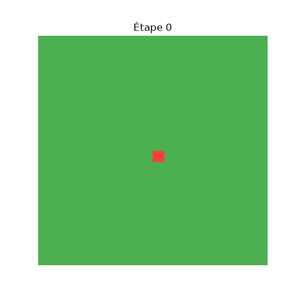

# Forest Fire Simulation

Simulation de la propagation d'un feu de forêt sur une grille, étape par étape, avec propagation probabiliste.

## Règles de simulation

- La forêt est une grille h×l où chaque case est **verte** (intacte), **rouge** (en feu) ou **grise** (cendres).
- À chaque étape :
  1. Les cases en feu s'éteignent (deviennent grises).
  2. Chaque case qui était en feu tente de propager à ses 4 voisines directes (haut/bas/gauche/droite) encore vertes, avec une probabilité `p`.
- La simulation s'arrête quand il n'y a plus aucune case en feu.

## Aperçu visuel



*Grille 20x20, probabilité de propagation p=0.55, généré avec `python3 generate_gif.py`.*

## Installation

```bash
python3 -m venv .venv
source .venv/bin/activate
pip install -r requirements.txt
```

Pour générer le GIF de démonstration (optionnel, dépendances supplémentaires) :
```bash
pip install -r requirements-dev.txt
python3 generate_gif.py
```

## Configuration

Les paramètres sont définis dans `config.json` :

```json
{
  "hauteur": 10,
  "largeur": 10,
  "positions_feu_initial": [[5, 5]],
  "probabilite_propagation": 0.6
}
```

Un paramètre optionnel `seed` peut aussi être ajouté pour rendre la simulation reproductible (même résultat à chaque exécution) :

```json
{
  "hauteur": 10,
  "largeur": 10,
  "positions_feu_initial": [[5, 5]],
  "probabilite_propagation": 0.6,
  "seed": 42
}
```

## Lancer la simulation

```bash
python3 main.py
```

## Lancer les tests

```bash
python3 -m pytest tests/ -v
```

## Exécution avec Docker

```bash
docker build -t forest-fire-simulation .
docker run --rm forest-fire-simulation
```

## Architecture

Le projet sépare les responsabilités en 4 modules indépendants :

- **`src/grid.py`** — `Grid` : gère uniquement l'état géométrique de la grille (positions, voisins, état des cases). Ne connaît aucune règle de propagation.
- **`src/simulator.py`** — `Simulator` : applique les règles de propagation du feu sur une `Grid`. Toute la logique métier est ici, ce qui permet de faire évoluer les règles sans toucher à `Grid`.
- **`src/config_loader.py`** — `ConfigLoader` : lit et valide le fichier de configuration JSON, avec des erreurs explicites (`ConfigError`) en cas de paramètres invalides.
- **`main.py`** — Orchestre le tout : charge la config, initialise la grille, lance la simulation, affiche le résultat étape par étape.

Cette séparation permet, par exemple, de changer le modèle de propagation (ou de simuler un tout autre phénomène de diffusion) sans modifier `Grid`, ou de changer le format de configuration sans toucher à la logique de simulation.

### Choix techniques

- **numpy** pour la grille : opérations vectorisées efficaces, notamment pour repérer rapidement toutes les cases en feu (`np.where`) ou vérifier s'il reste du feu (`np.any`).
- **Générateur aléatoire dédié** (`np.random.default_rng(seed)`) plutôt que l'état aléatoire global : permet de rendre une simulation reproductible via une seed, utile pour le débogage et les tests.
- **Calcul des nouvelles propagations avant application** : les nouvelles cases en feu sont d'abord collectées dans un `set`, puis appliquées après coup, pour garantir qu'une case ne propage pas dans la même étape où elle vient de prendre feu.
- **Gestion d'erreurs explicite** : une exception custom `ConfigError` distingue les erreurs de configuration (attendues, avec message clair) des bugs internes.

## Limites connues / pistes d'amélioration

- Pas de visualisation graphique (hors périmètre de l'exercice) — l'affichage console avec émojis suffit pour illustrer le comportement.
- La propagation est actuellement synchrone au sein d'une étape (chaque case rouge tire indépendamment pour chacune de ses voisines) — comportement conforme à l'énoncé.

## Pistes d'extension

L'architecture actuelle, en séparant `Grid` (état), `Simulator` (règles) et `ConfigLoader` (paramètres), permet d'envisager plusieurs extensions sans remettre en cause la structure du projet :

- **Facteur de vent** : une direction dominante pourrait moduler la probabilité de propagation selon le voisin (`p` différent pour chaque direction plutôt qu'une valeur unique) — modification localisée à `Simulator.step()`, sans toucher à `Grid`.
- **Hétérogénéité du terrain** : des probabilités de propagation variables par case (type de végétation, humidité) demanderaient d'enrichir `Grid` avec une couche de métadonnées par case, sans changer la logique de `Simulator`.
- **Parallélisation** : sur une grille très large, le calcul des propagations par case pourrait être vectorisé entièrement avec numpy plutôt qu'en boucle Python, pour de meilleures performances.
- **Persistance des résultats** : export de l'historique en format structuré (CSV, Parquet) pour analyse statistique a posteriori sur de nombreuses simulations.